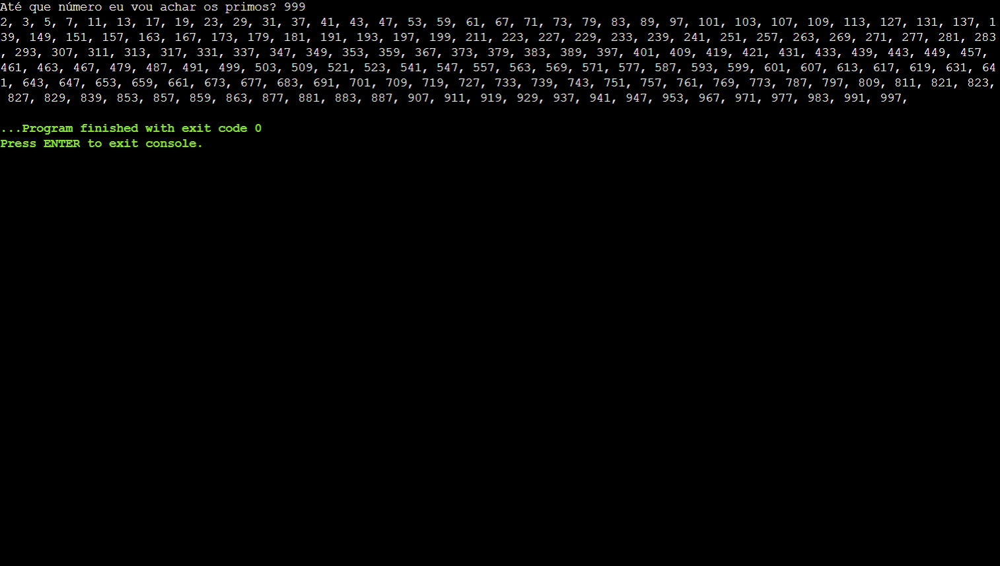

<h1 align="center"> Projeto C - Números Primos de Crivo </h1>

Projeto em Linguagem C durante o curso Análise e Desenvolvimento de Sistemas pela Fatec Ipiranga.

---

 

  

---
## 💻 Tecnologias

Esse projeto foi desenvolvido com as seguintes tecnologias:

- Linguagem C
- Git e Github

---

## 🚧 Projeto

Projeto em Linguagem C onde o usuário digita até que número o programa deve achar número Primos. O projeto usa o método do Crivo de Eratóstenes.
Mais Infomações sobre o Teorema dos Números Primos de Eratóstenes: https://pt.wikipedia.org/wiki/Crivo_de_Erat%C3%B3stenes

Você pode ver o Projeto e testar neste link: [Batalha Naval - C](https://onlinegdb.com/HaS9c9JHLF)

--- 
